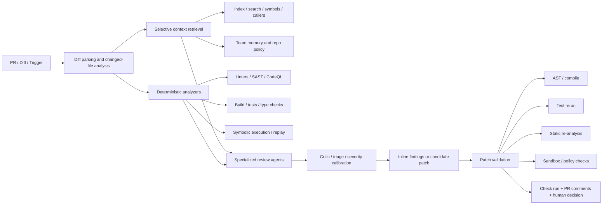
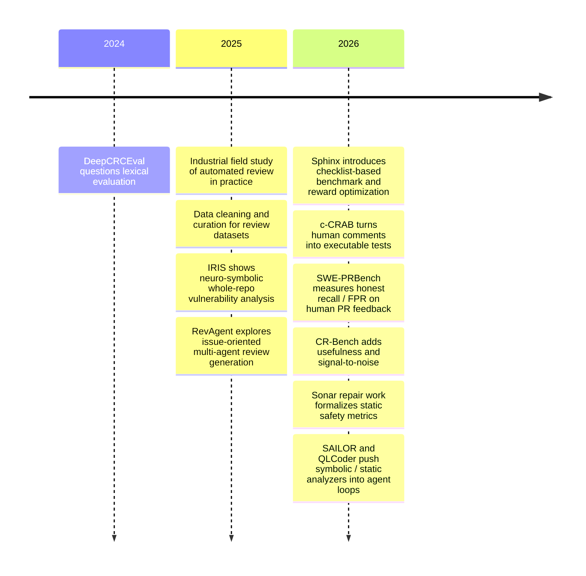

# Agentic Code Review Tools in 2026

## Executive Summary

The strongest result from the 2023–2026 literature is that **agentic code review is useful, but not yet trustworthy as a standalone reviewer**. On the hardest public-style benchmarks, current systems still miss most human-flagged issues: SWE-PRBench reports that eight frontier models detect only **15–31%** of human review issues on a diff-only setting, with false-positive rates from **0.193 to 0.417**; c-CRAB reports that the union of four current review tools passes only **41.5%** of the executable-review tests derived from human comments. At the same time, these systems are not useless noise: c-CRAB’s manual label study found **84%** of sampled AI comments useful, and an industrial field study found **73.8%** of automated comments were resolved by developers, even though PR closure time increased. The right interpretation is not “AI review is bad,” but rather “AI review is currently best as a **high-signal first-pass assistant with human oversight**, not as a merge gate or a replacement for senior review.” citeturn4view0turn4view2turn3view5turn12view8

What separates the better systems from the weaker ones is increasingly clear. Reliable tools in 2026 are not “just an LLM on a diff.” They are **hybrid review stacks** that combine selective repository retrieval, deterministic analyzers, test/build execution, severity calibration, persistent team memory, and patch validation. Recent work also shows that *more* context is not automatically better: SWE-PRBench found that every tested model degraded when moving from carefully structured diff-only prompts to richer file- and repo-context prompts, attributing much of the drop to **attention dilution** rather than lack of information. This is one of the clearest empirical findings in the area, and it strongly argues for **retrieval and compression**, not naive “stuff the whole repo into the prompt.” citeturn4view2turn4view4

A second strong result is that **neuro-symbolic fusion is where real reliability gains appear**. IRIS couples LLM inference with static analysis and whole-repository reasoning and substantially outperforms baseline CodeQL on real Java vulnerabilities. Adjacent 2026 systems such as SAILOR and QLCoder push further, combining CodeQL, LLM orchestration, symbolic execution, compilation feedback, SARIF/CodeQL artifacts, and concrete replay to validate findings or synthesized analyzers. In other words, the most credible work is moving away from “generate one comment” and toward **agentic evidence pipelines**. citeturn2view6turn28view0turn28view2

No organization-specific preferences were specified beyond English output and no compute constraint. I therefore emphasize patterns that generalize across polyglot codebases, PR workflows, and security-sensitive repositories.

## What Makes a Tool Reliable, Powerful, and Useful in 2026

A reliable agentic reviewer in 2026 has to satisfy three different criteria at once. It must be **reliable** in the narrow sense of low hallucination and low false-positive burden; **powerful** in the sense of reasoning beyond surface diffs into cross-file and behavioral consequences; and **useful** in the operational sense of fitting into CI, reviewer workflows, and cost/latency budgets. The literature increasingly treats these as separate dimensions, because systems that maximize recall by spraying comments often damage trust, while systems that are surgically precise can still be too weak to catch real defects. citeturn5view0turn4view1turn12view8

The best-supported architectural pattern is a layered review pipeline: deterministic indexing and retrieval to obtain precise context; analyzers and execution tools to produce grounded evidence; one or more LLM-based agents to synthesize findings or patches; and a final validation stage that checks whether the proposed concern or patch survives compilation, tests, static re-analysis, or concrete replay. That pattern appears in research systems such as IRIS, SAILOR, and the multi-tool secure-code framework, and in production tooling from OpenAI, Anthropic, GitHub, Sonar, and Sourcegraph, albeit with different emphases. citeturn2view6turn28view0turn27search2turn19view0turn23view0turn21view0turn17view1turn30view0

This architecture is not theoretical. Anthropic’s Code Review explicitly describes “a fleet of specialized agents” reviewing a PR in the context of the **full codebase** with severity tags; GitHub Copilot code review adds **full project context gathering** through GitHub Actions-backed agentic capabilities; Codex runs tasks in isolated cloud environments, can run checks, and uses repository guidance via `AGENTS.md`; Sonar combines deterministic analysis with AI CodeFix and an MCP server for agent querying; Sourcegraph positions itself as a retrieval/context layer that lifts the ceiling of external agents through indexed search and MCP. citeturn32view1turn32view2turn19view0turn34view2turn34view3turn21view0turn30view0turn17view1turn17view2

### Architecture patterns and why they matter

| Pattern | What it does | Why it helps reliability | Representative evidence | Main weakness |
|---|---|---|---|---|
| Indexing and code search | Builds a searchable corpus of repo/repo-set state, symbols, and references | Gives precise context without dumping entire repos into prompts | Sourcegraph indexes connected repos using Zoekt for sub-second search across billions of lines; Cody uses advanced Search API for APIs, symbols, and usage patterns. citeturn17view2turn16view8 | Search is only a substrate; it does not itself decide what matters. |
| Selective retrieval | Pulls only the most relevant context around a change | Prevents context-window pollution and attention dilution | SWE-PRBench shows full-context prompts degrade all tested models; Sourcegraph explicitly frames Deep Search/MCP as a way to avoid context-window pollution. citeturn4view2turn17view3 | Hard retrieval problems remain for architecture intent and hidden constraints. |
| Static analysis | Runs rule-based analyzers and dataflow checks | Produces deterministic, auditable signals and higher-confidence gates | SonarQube AI CodeFix starts from Sonar issues; IRIS augments static analysis rather than replacing it. citeturn20view0turn2view6 | Static analyzers are incomplete and can still generate false alarms. |
| Symbolic execution | Explores paths to validate bug conditions or generate witnesses | Converts suspected issues into stronger evidence | SAILOR uses CodeQL + LLM harness synthesis + KLEE + AddressSanitizer replay. citeturn28view0 | Scaling and harness generation remain difficult without orchestration. |
| Test execution | Runs existing or generated tests to check behavior | Helps detect semantic regressions and validate patches | Codex can run tests/linters/type checks; Sonar repair evaluation uses AST validation and subsequent analysis/testing stages. citeturn34view2turn25view0 | Existing test suites may be weak; passing tests is not sufficient. |
| Sandboxing | Executes model actions in isolated containers or runners | Contains side effects and reduces security/privacy risk | Codex cloud tasks run in containers with agent internet access off by default; Claude GitHub Actions keeps code on GitHub runners; GitHub agentic review runs on GitHub or self-hosted runners. citeturn34view3turn32view7turn19view0 | Sandboxes add cost/latency and operational complexity. |
| Multi-agent orchestration | Splits work across specialists and critics | Improves coverage, specialization, and severity triage | RevAgent uses five category-specific agents plus a critic; Claude Code Review uses specialized agents; QLCoder uses an agentic synthesis loop with MCP. citeturn35view0turn32view2turn28view2 | Coordination overhead and extra latency; also more places to fail. |
| Neuro-symbolic fusion | Couples LLMs with analyzers, specs, and execution | Improves grounding on whole-repo or security-heavy tasks | IRIS outperforms CodeQL on CWE-Bench-Java; SAILOR and QLCoder continue this trend. citeturn2view6turn28view0turn28view2 | Often domain-specific and not yet generalized to broad PR review. |
| Patch validation | Re-checks candidate fixes before surfacing them | Reduces “fixed one thing, broke another” failure modes | Sonar repair study introduces SRSR/OIRR/SSR; c-CRAB evaluates whether review comments actually guide fixes that make executable tests pass. citeturn26view1turn3view1 | Validation cost can dominate runtime on large repos. |

A useful shorthand is that 2026 systems are most reliable when they behave like **review pipelines**, not like **chatbots with repository access**. The literature is converging on that point from several directions. citeturn2view6turn28view0turn34view0

## How the Field Evaluates Progress

The clearest methodological shift since 2023 is the move away from **BLEU/ROUGE-style lexical overlap** and toward **semantic**, **execution-based**, or **developer-utility** evaluation. DeepCRCEval argues that traditional text-similarity metrics fail for code review because benchmark comments are noisy and because good reviews can be phrased very differently from references; it reports that **less than 10%** of benchmark comments were high quality for automation, and that its mixed human/LLM evaluation reduces time and cost by **88.78%** and **90.32%** relative to fully human reassessment. GradedReviews then shows that semantic assessment methods substantially improve correlation with human scores, from **0.22** to **0.47**. citeturn9search1turn9search0

That shift matters because code review is not code generation. A model can do well on SWE-Bench-like repair tasks and still be poor at *judging* a proposed patch. SWE-PRBench makes this point explicitly: despite strong coding-benchmark performance, the evaluated models capture only a minority of issues human reviewers catch. c-CRAB goes one step further and turns human findings into executable tests, allowing review quality to be measured by whether the review-guided patch actually resolves the underlying issue. CR-Bench adds **usefulness** and **signal-to-noise ratio** to precision, recall, and F1 in an attempt to connect benchmark metrics to developer acceptance. citeturn2view1turn3view1turn5view0turn5view3

### Metrics that now matter most

In 2026, the most informative metrics are no longer single-score text overlap. The literature has converged on a bundle of metrics:

| Metric family | What it measures | Where it is used | Why it matters |
|---|---|---|---|
| Precision / Recall / F1 | Correctly identified issues versus missed and spurious findings | CR-Bench / CR-Evaluator. citeturn5view0turn5view3turn5view7 | Essential for balancing bug detection against comment burden. |
| False-positive rate / hallucination rate | Fraction of fabricated or unsupported findings | SWE-PRBench reports FPR from **0.193** to **0.417** across models. citeturn4view1turn4view2 | Directly tied to reviewer trust and triage cost. |
| Executable pass rate | Whether a review comment can guide a revision that makes derived tests pass | c-CRAB. citeturn3view1turn3view5 | Stronger than textual match because it checks the underlying concern. |
| Developer acceptance / usefulness / SNR | Whether comments are action-worthy rather than merely plausible | CR-Bench introduces usefulness and SNR; c-CRAB manual labels find **84%** usefulness on sampled comments. citeturn5view0turn5view3turn3view5 | Reflects operational value better than lexical metrics. |
| PR latency / workflow impact | Effect on review duration and throughput | Industrial field study found comments often resolved, but PR closure rose from **5h52m** to **8h20m** on average. citeturn12view8 | A tool that improves findings but slows delivery can still be net-negative. |
| Repair correctness / safety | Whether generated fixes resolve original issues without introducing new ones | Sonar repair study uses **SRSR**, **OIRR**, **SSR**. citeturn26view1turn26view2turn26view3 | Critical for automated patching and fix-suggestion systems. |
| Review comprehension | Whether the model actually understands the review task and intent | CodeReviewQA uses three MCQA probes plus a generative task on **900** curated examples from **199** repos and **9** languages. citeturn10view4turn11view7turn11view0 | Helps diagnose failure before full generative execution. |

### Benchmarks worth taking seriously

| Benchmark | Year | Task | Oracle / ground truth | Key metrics | Key takeaways | Sources |
|---|---|---|---|---|---|---|
| DeepCRCEval | 2024/2025 | Re-evaluate generated review comments | Human criteria + LLM evaluators | Quality discrimination, efficiency reduction | Shows benchmark comment quality is very low for automation and lexical metrics are misleading. | citeturn9search1turn9search3 |
| GradedReviews | 2025 | Assess review-quality scoring metrics | Manual grading of generated reviews | Correlation with human scores | Semantic scoring improves correlation from **0.22** to **0.47**. | citeturn9search0 |
| CodeReviewQA | 2025 | Code review comprehension and automated refinement | **900** manually curated examples from **199** repos, **9** languages | MCQA probe accuracy, ACR accuracy, contamination checks | Good at exposing intermediate failure modes; change localization is especially hard. | citeturn10view4turn11view6turn11view7 |
| Sphinx Benchmark | 2026 | PR review comment generation | **2,500** PRs across **5** languages, including bug-free cases | Checklist coverage, BLEU, ROUGE | Moves evaluation toward structured “review checklist” coverage instead of text match. | citeturn6view1turn6view6turn7view4 |
| c-CRAB | 2026 | Automated review-agent evaluation on real PRs | Human review feedback converted into executable tests | Test pass rate, manual usefulness | Strongest move toward objective review evaluation; current agents still solve only about **40%** of tasks. | citeturn3view1turn3view5 |
| SWE-PRBench | 2026 | Detect human-flagged review issues on PRs | **350** PRs with human annotations and frozen context configs | Detection rate, FPR, composite score | Best current public evidence that raw recall is still low and extra context can hurt. | citeturn2view1turn4view2turn4view3 |
| CR-Bench | 2026 | Real-world defect-focused code review utility | PR-style defects transformed from SWE-Bench + taxonomy | P/R/F1, usefulness, SNR | Valuable because it focuses on developer utility and severity/impact/category. | citeturn2view2turn5view0turn5view3 |

The benchmarking story therefore has two big messages. First, **text similarity is no longer credible as the primary measure**. Second, **benchmark design itself is now central**: if the oracle is weak, the conclusions will be weak. citeturn9search0turn3view1turn4view5

## Representative Research and What It Shows

The research trajectory since 2023 is surprisingly coherent. The field progressed from questioning legacy evaluation, to cleaning noisy datasets, to experimenting with multi-agent and checklist-based review generation, and finally to execution-grounded and neuro-symbolic evaluation/repair. The timeline below captures the major direction changes. citeturn9search1turn10view1turn35view0turn2view6turn2view3turn2view0turn2view1turn2view2turn25view0turn28view0turn28view2

### Core code-review papers

| Name | Year | Approach | Dataset | Key results | Limitations | Sources |
|---|---|---|---|---|---|---|
| Automated Code Review in Practice | 2025 | Industrial field study of an LLM PR-review tool based on Qodo PR-Agent | **4,335** PRs overall, **1,568** with automated review, among 238 practitioners | **73.8%** of automated comments were resolved; developers reported modest code-quality gains; average PR closure time rose from **5h52m** to **8h20m**. | Real production value, but also faulty reviews, unnecessary corrections, irrelevant comments, and longer review latency. | citeturn12view8 |
| Evaluating Large Language Models for Code Review | 2025 | Simplified code-review task: classify correctness and propose fixes | **492** AI-generated code blocks + **164** canonical HumanEval blocks | With problem descriptions, GPT-4o and Gemini 2.0 Flash reached **68.50% / 63.89%** correctness classification and **67.83% / 54.26%** correction rates. | Not PR review; uses snippets rather than real repository context or human-review workflows. | citeturn1search0 |
| Too Noisy To Learn | 2025 | LLM-based semantic cleaning of review-comment datasets | CodeReviewer benchmark | Only **64%** of sampled training comments were valid; LLM cleaning raised valid-comment proportion to as high as **85%**; cleaned models improved BLEU-4 by **7.5–13%** and improved information/relevance scores. | Still benchmark-centric; improves training data quality more than end-to-end review reliability. | citeturn10view1 |
| Harnessing LLMs for Curated Code Reviews | 2025 | LLM-based curation pipeline for code review data | Largest public code review dataset | Curated comments became clearer and more concise, improved comment generation, and led to more accurate downstream code refinement. | The abstract reports directionally stronger data and downstream results, but public headline numbers are limited in the abstract itself. | citeturn36view0turn36view3 |
| RevAgent | 2025 | Issue-oriented multi-agent comment generation with 5 specialist reviewers + critic | Curev, **20,000** instances across 5 issue types | Improves best baselines by **12.90%** BLEU, **10.87%** ROUGE-L, **6.32%** METEOR, **8.57%** SBERT; overall issue-category accuracy **60.20%**; still only **21.69%** for bug-fix category. | Gains are largely on generation metrics; 48% of failure cases are attributed to missing project-specific knowledge. | citeturn35view0 |
| Sphinx | 2026 | Context-rich PR-review dataset, checklist evaluation, and checklist-reward policy optimization | ~**200,000** crawled PRs; **41,700** train; benchmark of **2,500** PRs across 5 languages | Fine-tuned closed/open models improve checklist coverage; `Sphinx-4o-SFT` reaches **41.12** checklist-coverage average versus **34.23** for base GPT-4.1, and `Sphinx-14B-SFT-CRPO` beats base Qwen2.5-Coder-14B by **+5.02** checklist points. | Restricts inputs to single-file PRs and <=32K tokens; benchmark depends on pseudo-solution generation and checklist design. | citeturn6view1turn6view6turn7view0turn7view5 |
| c-CRAB | 2026 | Benchmark that converts human PR comments into executable tests | Final benchmark includes **184** PR instances and **234** tests | Claude Code leads evaluated tools at **32.1%** overall pass rate; Codex **20.1%**, Devin **24.8%**, PR-Agent **23.1%**; union across all tools reaches **41.5%**; manual usefulness over sampled comments is **84%**. | Focuses only on comments that can be converted into executable tests; relies on a coding agent in the evaluation loop. | citeturn3view1turn3view5 |
| SWE-PRBench | 2026 | Human-annotated PR benchmark with context ablations | **350** PRs from active OSS repos; 100-PR stratified baseline sample | Models detect only **15–31%** of human-flagged issues on diff-only; FPR ranges **0.193–0.417**; all eight tested models degrade from diff-only to fuller context. | Uses validated LLM-as-judge rather than executable oracle; public baseline uses a 100-PR sample. | citeturn2view1turn4view0turn4view2turn4view3 |
| CR-Bench | 2026 | Defect-focused benchmark plus CR-Evaluator | Derived from SWE-Bench / SWE-Bench Verified with category-impact-severity taxonomy | Adds usefulness rate and SNR to P/R/F1; emphasizes that production agents need utility, trustworthiness, and factuality, not just bug recall. | Focuses on objectifiable defect-finding, not the full social or architectural scope of human review. | citeturn2view2turn5view0turn5view7 |

### Adjacent papers that matter because they improve grounding and validation

| Name | Year | Approach | Dataset | Key results | Why it matters for code review | Sources |
|---|---|---|---|---|---|---|
| IRIS | 2025 | Neuro-symbolic whole-repo vulnerability detection using LLM-inferred taint specs + static analysis | CWE-Bench-Java, **120** manually validated vulns | CodeQL detects **27** vulns; IRIS with GPT-4 detects **55** and reduces average false-discovery rate by **5 percentage points**; finds **4** previously unknown vulnerabilities. | Exposes the value of LLM reasoning when coupled to repository-scale static analysis rather than used alone. | citeturn2view6 |
| An evaluation study of LLMs for addressing code quality issues | 2026 | SonarQube-driven code repair with AST validation, re-analysis, and semantic checks | **20** Python projects; validated subset of **22,259** function-level issue groups | Average issue reduction **36.02%**; best SRSR values: Grok **62.08%**, GPT-4o **59.13%**; after filtering structurally difficult rule types, Grok reaches **74.21%**, GPT-4o **70.79%**. | Shows useful patch-validation metrics for practical autofix systems: complete repair, issue resolution, and non-regression. | citeturn26view0turn26view1turn26view2turn26view3 |
| Improving LLM-Assisted Secure Code Generation through RAG and Multi-Tool Feedback | 2026 | Iterative self-repair using compiler diagnostics, CodeQL, KLEE, and retrieval memory | **3,242** generated programs | Reduces DeepSeek vulnerabilities by **96%**; lowers critical security defect rate on CodeLlama from **58.55%** to **22.19%**. | A direct blueprint for review tools that propose patches and must harden them before surfacing. | citeturn27search2turn27search4 |
| SAILOR | 2026 | Static-analysis-informed, LLM-orchestrated symbolic execution with concrete replay | **10** C/C++ projects, **6.8M** LOC | Finds **379** unique previously unknown vulnerabilities, over **30×** more confirmed vulnerabilities than strongest baseline. | Demonstrates how symbolic execution can become practical when harness synthesis is automated by agents. | citeturn28view0 |
| QLCoder | 2025/2026 | Agentic CodeQL query synthesis from CVE metadata using MCP, LSP, retrieval, and execution feedback | CWE-Bench-Java, **176** CVEs across **111** Java projects | **100%** query compilation, **53.4%** success; F1 **0.7** versus **0.048** for IRIS and **0.073** for CodeQL on this task. | Suggests a future where review agents generate or adapt custom analyzers for the exact defect family in a PR. | citeturn28view2 |

The synthesis across these papers is straightforward. **Pure review-comment generation improved modestly; grounded detection and grounded validation improved much more.** The best public evidence points toward systems that (a) use **narrow, selective context**, (b) use analyzers and tests as first-class tools, and (c) treat evaluation as an oracle problem, not a wording problem. citeturn35view0turn4view2turn3view1turn2view6turn28view0

## Industry Systems and Product Evidence

Public product evidence is uneven. Most vendors publish strong feature documentation and some workflow or speed claims, but very few publish rigorous public-quality benchmarks for their full review products. Independent public benchmarks also cover only a subset of products. So the strongest way to read the market in 2026 is: **take vendor docs as evidence of architecture and intended behavior, and take papers like c-CRAB/SWE-PRBench as evidence of the current quality ceiling.** citeturn16view0turn21view0turn23view0turn30view0turn3view5turn4view0

| System | Current positioning | Techniques visible from public docs | Public empirical claims | What the evidence supports | Sources |
|---|---|---|---|---|---|
| GitHub Copilot Code Review | GitHub-native automatic or on-demand reviewer | Diff review, inline comments, full-project-context gathering through agentic capabilities, optional flow into Copilot cloud agent, custom instructions | Reviews usually complete in **<30s**; one premium request per review; from **June 1, 2026** runs consume GitHub Actions minutes on GitHub-hosted runners. | Mature workflow integration and practical automation, but GitHub explicitly says reviews are *not guaranteed* to catch all problems and should be validated by humans. | citeturn16view1turn16view2turn19view0turn18view5 |
| OpenAI Codex code review in GitHub | Cloud coding agent with GitHub review mode | Cloud sandbox tasks, PR review comments, `AGENTS.md` repository guidance, automatic reviews, follow-up fix tasks, configurable internet | Codex review focuses only on **P0/P1** issues; tasks run in isolated cloud containers; agent internet is off by default unless enabled. | Strong severity focus, explicit repo guidance, and good sandboxing; public docs emphasize architecture and safety more than measured review recall. | citeturn21view0turn21view1turn34view2turn34view3 |
| Anthropic Claude Code Review | Research-preview automated reviewer for GitHub PRs | Multi-agent analysis over full codebase, severity tagging, `CLAUDE.md` / `REVIEW.md`, GitHub check runs, managed service or self-run CI alternatives | Findings tagged as Important/Nit/Pre-existing; check run remains neutral by default; GitHub Actions integration says code stays on GitHub runners. | Among the clearest examples of a modern agentic-review architecture with severity calibration and project memory. Public docs are excellent on control surfaces, light on benchmark numbers. | citeturn23view0turn32view0turn32view4turn32view5turn32view7 |
| SonarQube + AI CodeFix + MCP | Deterministic verification layer with AI-assisted remediation | Static analysis, AI CodeFix on selected rules, MCP server for AI agents, IDE integrations, BYO model via Azure OpenAI | Up to **50% faster** analysis for JS/TS/Python/Kotlin; detects **450+** secret patterns; AI CodeFix available for selected rule sets and languages; Sonar cites **96%** developer mistrust of AI-generated code in its survey/marketing. | Strongest on deterministic code quality/security verification and compliance. AI layer is constrained and rule-scoped, which is a feature for reliability. | citeturn30view0turn20view0 |
| Sourcegraph Cody / Code Search + MCP | Context and retrieval layer rather than a standalone PR bot | Indexed multi-repo retrieval, advanced search, code intelligence, MCP access for external agents, security-review automation via Sherlock | Sourcegraph indexes code with Zoekt for sub-second search across billions of lines; a Workiva case study outside review reports **80%** time reduction for large-scale code changes; Sherlock blends diffs + SAST alerts + Sourcegraph context. | Best interpreted as **infrastructure for high-context review systems**, especially at monorepo or multi-repo scale, not a direct replacement for reviewer logic. | citeturn17view2turn16view8turn17view1turn29search7turn16view9 |

A common pattern across these production systems is visible even without vendor-neutral benchmarking. All of them are moving toward **project memory/config files**, **severity control**, **safe execution environments**, and **selective tooling hooks** rather than unconstrained free-form comments. That is exactly what the research literature says should happen. citeturn19view0turn21view0turn32view4turn34view0

## Failure Modes and Deployment Best Practices

### Common failure modes

The most important empirical failure mode today is **low recall hidden behind plausible language**. SWE-PRBench and c-CRAB both show that current systems can sound competent and still miss most of what humans catch. This is the core reason reliable teams in 2026 keep AI review in a first-pass role rather than making it the sole approval signal. citeturn4view0turn3view5

The second major failure mode is **context dilution**. SWE-PRBench is especially valuable here because it contradicts a very common product assumption: adding full file or repo context in a flat prompt degraded every tested model. The lesson is not “ignore context,” but “retrieve and structure the smallest decisive context.” Sourcegraph’s and Anthropic’s 2026 documentation implicitly follows that logic by emphasizing MCP/context layers and focused repository instructions rather than indiscriminate context stuffing. citeturn4view2turn17view3turn32view5

A third failure mode is **training-data and benchmark noise**. DeepCRCEval, Too Noisy To Learn, and Curated Code Reviews all converge on the point that existing review corpora contain large amounts of vague, conversational, or otherwise poor supervision. If a tool is trained on noisy comments and evaluated with weak lexical metrics, it can appear to improve while remaining operationally weak. citeturn9search1turn10view1turn36view0

A fourth failure mode is **semantic drift in suggested fixes**. The 2026 Sonar repair study shows that models often remove original issue markers while introducing new violations, which is why it distinguishes complete repair, issue resolution, and static safety. This is also why c-CRAB’s executable-test framework is more convincing than wording-based evaluation for patch-guided review comments. citeturn26view1turn26view2turn26view3turn3view1

A fifth failure mode is **workflow drag**. The industrial field study is valuable precisely because it shows both sides: plenty of automated comments were resolved, but average PR closure time still increased. Put differently, a reviewer that catches useful issues can still be net harmful if it adds too much triage burden or too many low-severity comments. citeturn12view8

### Best practices for deployment

**Use team memory and repo-level policy files.** Recent production systems all expose persistent, repo-specific instruction mechanisms because this is one of the highest-leverage ways to reduce repeat mistakes. GitHub supports custom instructions; Codex uses `AGENTS.md`; Claude Code distinguishes `CLAUDE.md` for general project context from `REVIEW.md` for high-priority review behavior. Anthropic’s docs are especially explicit that these files should encode what would otherwise need to be re-explained, including coding standards, architecture rules, and verification bars. citeturn18view5turn21view0turn32view4turn23view2turn34view0

**Calibrate severity aggressively.** The production pattern in 2026 is to keep the model’s comment surface narrow. Codex flags only **P0/P1** issues in GitHub review; Claude Code Review lets teams redefine what counts as Important, cap nit volume, skip generated code, and require evidence for certain categories of claim. This is exactly the right response to benchmark evidence on false-positive burden and workflow slowdown. citeturn21view1turn32view5turn4view1turn12view8

**Make deterministic checks the hard gates and AI review the adaptable layer.** Sonar, Sourcegraph, and the research stack all point the same way: use linters, type checkers, SAST, dependency policies, build/tests, and static analysis as the merge-gating substrate; use AI review for semantic issues, risk narration, test suggestions, and patch drafting. If you want automated merge blocking from AI review, only promote findings that survive a validator or evidence bar. Claude’s neutral check-run model is a sensible default for this reason. citeturn30view0turn17view0turn32view0

**Optimize for selective context, not maximal context.** In practice this means diff-first prompts, retrieval over callers/import graphs/symbol references, explicit path/module focus, and suppression of irrelevant files such as lockfiles or generated code. The strongest direct evidence for this recommendation is SWE-PRBench’s context-ablation result. citeturn4view2turn19view1turn32view5

**Plan cost and latency explicitly.** Review cost is now a real line item. GitHub Copilot code-review runs consume premium requests and, on GitHub-hosted runners, Actions minutes beginning June 2026; Claude Code Review and GitHub Actions introduce managed-service or runner costs; Codex cloud creates containers per task; and model selection itself has cost/quality trade-offs. SWE-PRBench, for example, reports that DeepSeek V3 delivered top-tier detection at roughly **9×** lower input-token cost than GPT-4o, while GPT-4o had lower hallucination. There is no universal best model—only trade-offs that should be matched to review tier. citeturn19view0turn19view2turn23view1turn34view3turn4view1turn4view2

**Treat privacy and execution boundaries as part of review quality.** Sandboxed execution is not a side issue. Codex cloud uses isolated containers with agent internet off by default; Claude GitHub Actions says code stays on GitHub runners; GitHub supports self-hosted runners for its agentic capabilities; SonarQube’s 2026 architecture explicitly leans on BYO models via Azure OpenAI to avoid sending code to third-party providers for AI CodeFix. That combination—restricted network, controlled runners, and constrained model endpoints—is likely to be the standard enterprise deployment pattern for sensitive repositories. citeturn34view3turn32view7turn19view0turn30view0

## Open Problems and Future Directions

The first open problem is **representation of repository context**. The strongest public benchmark result in 2026 is that naive long-context prompting does not solve review. That pushes the field toward graph-aware retrieval, ownership-aware summaries, API-usage slices, and compressed intent artifacts rather than raw file dumps. Sourcegraph’s context-layer framing and Anthropic/OpenAI project-policy files already point in that direction, but public research still lacks a mature, shared recipe for “the right context” in review-specific tasks. citeturn4view2turn17view3turn32view5turn34view0

The second open problem is **better oracles for review quality**. c-CRAB is a major advance because it turns some human review concerns into executable tests, but it necessarily excludes comments that are conversational, architectural, or weakly formalizable. SWE-PRBench and CR-Bench fill part of that gap with human annotation and utility metrics, yet the field still lacks a benchmark that jointly captures defect detection, architectural judgment, and human-usable explanation quality at production scale. citeturn3view1turn2view1turn5view0

The third open problem is **automated verification of review comments before they are posted**. Anthropic’s docs already let teams require evidence for certain findings, and research systems increasingly rely on analyzers, tests, or symbolic execution. The natural next step is a reviewer that posts only comments which have passed a minimal verifier: “compile-backed,” “test-backed,” “static-backed,” or “symbolic-backed.” SAILOR and the multi-tool secure-code framework are especially promising here because they show how to convert candidate reasoning into hard evidence. citeturn32view5turn28view0turn27search2

The fourth open problem is **automatically generating the right analyzers and harnesses for the review at hand**. QLCoder shows that agents can synthesize CodeQL queries from CVEs, while SAILOR shows that agents can synthesize symbolic-execution harnesses and then refine them against feedback loops. This suggests a future where a review agent encountering an unusual defect family can build its own verification artifact instead of relying only on pre-existing lint rules or generic model intuition. citeturn28view2turn28view0

The fifth open problem is **organizational learning and long-horizon memory**. Production tools now expose `AGENTS.md`, `CLAUDE.md`, `REVIEW.md`, custom instructions, and auto memory because repeated corrections are common. But these mechanisms are still mostly local, human-authored, and manual. A promising direction is controlled accumulation of reviewer memory from accepted comments, postmortems, architecture decisions, and reverted regressions—while preserving auditability and avoiding stale or overfitted rules. citeturn23view2turn32view4turn34view0

The sixth open problem is **trust calibration**. The literature now has good evidence that raw accuracy is not enough; trust depends on false-positive rate, severity discipline, explanation quality, and the ability to avoid slowing reviews down. The next generation of tools should expose calibrated confidence, evidence provenance, and separate channels for blocking defects versus advisory nits. Claude’s severity model, Codex’s P0/P1 focus, and CR-Bench’s usefulness/SNR direction are all early signs of this, but the problem is far from solved. citeturn32view0turn21view1turn5view0

The bottom-line research conclusion for 2026 is therefore fairly crisp: **the winning design is not a bigger reviewer model; it is a better review system**. The highest-confidence path forward is selective retrieval plus deterministic analyzers plus execution-backed validation plus severity-calibrated human-AI workflows. Public evidence does not yet justify trust in fully autonomous code review, but it does justify serious investment in **agentic reviewer stacks** that can narrow reviewer attention, catch complementary issues, draft patches, and learn repository-specific standards over time. citeturn4view2turn3view5turn2view6turn30view0turn34view0

### Open questions and limitations

This report prioritizes **primary sources and official docs**, so some popular vendor tools with limited public technical disclosure are discussed more cautiously than users may expect. Public benchmark coverage of full commercial products is still thin, and several important 2026 results are preprints rather than long-settled journal articles. The evidence base is nevertheless already strong enough to support the main conclusion: **agentic code review in 2026 is most reliable when it is tool-grounded, validated, and tightly integrated into human review—not when it is treated as an autonomous oracle.** citeturn3view5turn4view0turn23view0turn16view0